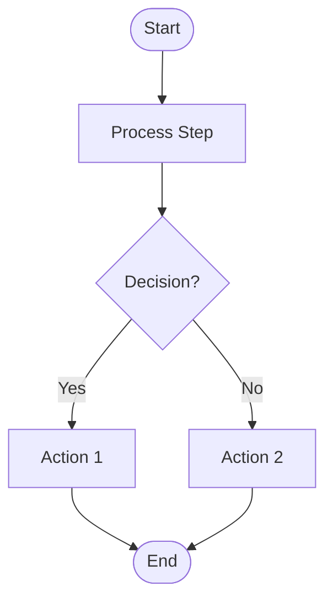
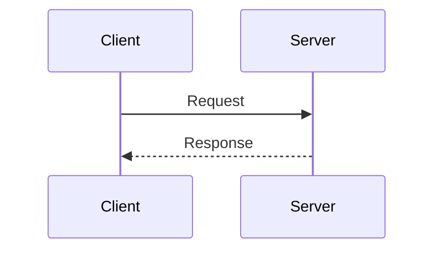
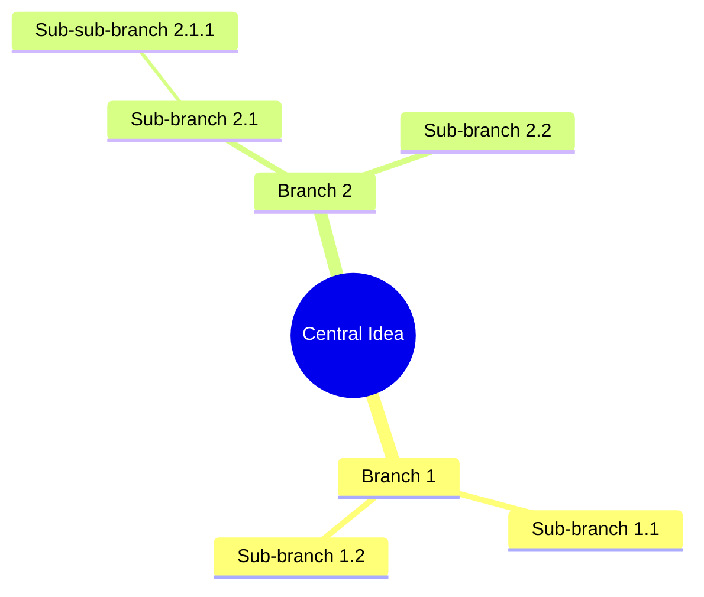

# Diagram Converter Tool - Flowchart Perfected

A powerful command-line tool for converting Mermaid diagrams to Draw.io XML format and generating Markdown documentation. Perfect for developers who want to automate diagram creation and documentation.

## Features

- **Mermaid to Draw.io Conversion**: Convert Mermaid flowcharts, sequence diagrams, and mindmaps to editable Draw.io XML files.
- **Markdown Documentation**: Generate structured Markdown documentation from your diagrams.
- **Advanced Layout Engine**: Uses Dagre for professional graph layout, ensuring clean, non-overlapping diagrams with optimal edge routing.
- **Multiple Diagram Types**: Supports flowcharts (with complex branches and cycles), sequence diagrams, and mindmaps.
- **Command-Line Interface**: Easy to integrate into build processes, CI/CD pipelines, or documentation workflows.

## Recent Improvements

- **Dagre Integration**: Replaced custom layout algorithm with Dagre for better node positioning and edge routing in flowcharts.
- **Edge Routing**: Automatic edge routing that avoids crossing nodes, using Dagre's calculated paths.
- **Enhanced Flowchart Support**: Handles complex flowcharts with branches, merges, cycles, and decision points perfectly.
- **Fallback Logic**: Maintains compatibility with existing diagrams while improving layout quality.

## Installation

1. **Prerequisites**:
   - Node.js (v14 or higher)
   - npm

2. **Clone the Repository**:
   ```bash
   git clone https://github.com/DisanduP/Diagram-Converter-Tool-Flowchart-Perfected.git
   cd Diagram-Converter-Tool-Flowchart-Perfected
   ```

3. **Install Dependencies**:
   ```bash
   npm install
   ```

## Quick Start (For New Users)

If you're setting up on a new laptop, follow these exact steps:

```bash
# 1. Clone the repository
git clone https://github.com/DisanduP/Diagram-Converter-Tool-Flowchart-Perfected.git

# 2. Navigate to the project directory
cd Diagram-Converter-Tool-Flowchart-Perfected

# 3. Install dependencies
npm install

# 4. Test the installation
node diagram-cli.js --help

# 5. Create a sample flowchart (copy this to a file called test.mmd)
echo 'flowchart TD
    A[Start] --> B[Process]
    B --> C[End]' > test.mmd

# 6. Convert it to Draw.io format
node diagram-cli.js to-drawio test.mmd

# 7. Open the result in Draw.io
# The file test.drawio will be created and can be opened at app.diagrams.net
```

That's it! You're ready to convert Mermaid diagrams to professional Draw.io files.

## Docker Usage

You can also run the tool using Docker for easy deployment and isolation:

### Build the Docker Image

```bash
# Build the image
docker build -t diagram-converter .

# Or build with a specific tag
docker build -t diagram-converter:v1.0 .
```

### Run the Tool

```bash
# Show help
docker run --rm diagram-converter --help

# Convert a diagram (mount current directory)
docker run --rm -v $(pwd):/data -w /data diagram-converter to-drawio my-diagram.mmd

# Convert with custom output directory
docker run --rm -v $(pwd):/data -w /data diagram-converter to-drawio my-diagram.mmd -d /data/output

# Full conversion
docker run --rm -v $(pwd):/data -w /data diagram-converter convert my-diagram.mmd

# Validate a diagram
docker run --rm -v $(pwd):/data -w /data diagram-converter validate my-diagram.mmd
```

### Docker Examples

```bash
# Convert a flowchart
docker run --rm -v $(pwd):/data -w /data diagram-converter to-drawio flowchart.mmd

# Generate documentation
docker run --rm -v $(pwd):/data -w /data diagram-converter to-markdown sequence.mmd

# Process multiple files
for file in *.mmd; do
  docker run --rm -v $(pwd):/data -w /data diagram-converter convert "$file"
done
```

### Docker Compose (Optional)

If you prefer using Docker Compose, create a `docker-compose.yml`:

```yaml
version: '3.8'
services:
  diagram-converter:
    build: .
    volumes:
      - .:/data
    working_dir: /data
    command: ["--help"]
```

Then run:
```bash
docker-compose run --rm diagram-converter to-drawio my-diagram.mmd
```

## Usage

### Basic Commands

```bash
# Convert Mermaid to Draw.io XML
node diagram-cli.js to-drawio your-diagram.mmd

# Generate Markdown documentation
node diagram-cli.js to-markdown your-diagram.mmd

# Full conversion (both Draw.io XML and Markdown)
node diagram-cli.js convert your-diagram.mmd

# Validate Mermaid syntax
node diagram-cli.js validate your-diagram.mmd
```

### Command Options

#### Convert to Draw.io

```bash
node diagram-cli.js to-drawio <file.mmd> [options]
```

Options:
- `-d, --output-dir <dir>` - Output directory (default: current)
- `-n, --name <name>` - Diagram name
- `-q, --quiet` - Suppress info messages

#### Generate Markdown

```bash
node diagram-cli.js to-markdown <file.mmd> [options]
```

Options:
- `-d, --output-dir <dir>` - Output directory (default: current)
- `-n, --name <name>` - Diagram name
- `-q, --quiet` - Suppress info messages

#### Full Conversion

```bash
node diagram-cli.js convert <file.mmd> [options]
```

Options:
- `-d, --output-dir <dir>` - Output directory (default: current)
- `-n, --name <name>` - Diagram name
- `-q, --quiet` - Suppress info messages

#### Validate Mermaid

```bash
node diagram-cli.js validate <file.mmd> [--json]
```

Options:
- `-o, --output <file>` - Output validation report as Markdown
- `--json` - Output as JSON
- `-q, --quiet` - Quiet mode, exit with code only

### Examples

```bash
# Convert flowchart to Draw.io
node diagram-cli.js to-drawio flowchart.mmd -o flowchart.drawio

# Generate documentation
node diagram-cli.js to-markdown sequence.mmd -o sequence-docs.md

# Full conversion with all outputs
node diagram-cli.js convert flowchart.mmd -d ./output

# Validate before conversion
node diagram-cli.js validate diagram.mmd --json

# Read from stdin
cat diagram.mmd | node diagram-cli.js to-drawio - -o output.drawio
```

## Supported Diagram Types

### Flowcharts



Supported shapes:
- `[ ]` - Rectangle
- `( )` - Rounded rectangle
- `{ }` - Diamond (decision)
- `[[ ]]` - Subroutine
- `([ ])` - Stadium (terminal)
- `(( ))` - Circle

### Sequence Diagrams



### Mindmaps



## Output Formats

### Draw.io XML

The generated `.drawio` file can be:
- Opened at [app.diagrams.net](https://app.diagrams.net)
- Edited with the VS Code Draw.io extension
- Imported into Confluence, Notion, etc.

### Markdown

The generated Markdown includes:
- Diagram overview and type
- Entity/node table with shapes
- Relationship/edge table
- Subgraph documentation
- Original Mermaid code for reference

## File Structure

```
diagram-cli.js          # Main CLI interface
mermaid-parser.js       # Mermaid syntax parser
drawio-converter.js     # Draw.io XML generator with Dagre layout
markdown-converter.js   # Markdown documentation generator
index.js               # Entry point
package.json           # Dependencies
```

## How It Works

1. **Parsing**: Reads and parses Mermaid syntax into structured data.
2. **Layout**: Uses Dagre to calculate optimal node positions and edge routes.
3. **Conversion**: Generates Draw.io XML with proper shapes, connections, and styling.
4. **Documentation**: Creates Markdown files with diagram descriptions and flow explanations.

## Advanced Features

- **Automatic Layout**: No manual positioning needed—Dagre handles it all.
- **Edge Avoidance**: Edges route around nodes to prevent visual clutter.
- **Shape Recognition**: Supports rectangles, diamonds (decisions), circles, and more.
- **Label Support**: Preserves edge and node labels in the output.

## Programmatic Usage

You can also use the converter as a library:

```javascript
const { parseMermaid, toDrawio, toMarkdown } = require('./diagram-converter');

const mermaidCode = `
flowchart TD
    A[Start] --> B[End]
`;

// Parse
const parsed = parseMermaid(mermaidCode);
console.log(parsed.nodes); // [{id: 'A', label: 'Start', ...}, ...]

// Convert to Draw.io XML
const xml = toDrawio(parsed, { name: 'My Diagram' });

// Convert to Markdown
const markdown = toMarkdown(parsed, mermaidCode);
```

## Conversion Rules

The CLI follows the BMAD Diagram Converter agent's ruleset:

1. **Node IDs**: Alphanumeric with underscores only
2. **Arrows**: Simple arrows (`-->`, `---`)
3. **Direction**: TD, LR, RL, BT
4. **Grid alignment**: Coordinates rounded to multiples of 10
5. **Unique IDs**: All Draw.io elements have unique IDs

## Limitations

- Complex styling (classDef, style) is not preserved in Draw.io
- Some advanced Mermaid features may not convert perfectly
- Chained arrows should be split into separate lines for best results

## Troubleshooting

- **Installation Issues**: Ensure Node.js and npm are installed. Run `npm install` in the project directory.
- **Conversion Errors**: Check Mermaid syntax with `validate` command.
- **Layout Problems**: For very complex diagrams, try simplifying or breaking into smaller diagrams.

## Contributing

1. Fork the repository
2. Create a feature branch
3. Make your changes
4. Test with various diagram types
5. Submit a pull request

## License

ISC License - see package.json for details.

## Support

For issues or questions, please open an issue on GitHub or contact the maintainer.

---

**Note**: This tool is optimized for flowchart generation with professional layouts. For simple diagrams, Draw.io's native import may suffice, but this tool excels in automation and complex graph handling.
